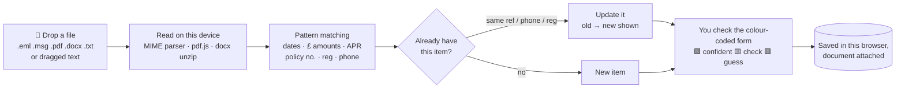

# Personal Admin Assistant

One place for every insurance policy, contract and regular payment: mobile phones, TV
licence, council tax, cars, credit cards and the rest. It reminds you before anything renews,
and you can drop in emails and documents to have the details read automatically.

**It's local-only.** Your data is stored in the browser on your device, and the page's
security policy stops it making *any* network connection. Use it as an installed app on your
Android phone, or as a single file on your computer.

## Using it

### 📱 On your Android phone (installed app)

1. Open **https://robt8.github.io/personal-admin/** in Chrome.
2. Tap **Install** on the banner (or ⋮ menu → **Install app**). It now sits on your home screen,
   opens full-screen and works offline.
3. In **Settings**, tap **Turn on notifications** to get reminders.

Once installed, **Personal Admin appears in Android's Share menu**:

| You have… | Do this |
|---|---|
| A PDF attachment in Gmail | Open it → **Share** → **Personal Admin** |
| The email itself | Select its text → **Share** → **Personal Admin** (or copy, then paste in *Add from file*) |
| A paper letter | *Add from file* → **📷 Photo of a letter**. The photo is kept with the item, but it isn't read, so type the key details yourself. Or use Google Lens → *Copy text* → paste |
| A file in Drive / Downloads | *Add from file* → **Choose files** |

**Reminders on the phone:** the app checks for due reminders whenever you open it, and in the
background about twice a day (Android decides exactly when). For an alert at an exact time,
use **Calendar → Export (.ics)** too.

**Your data stays on the phone.** The website only delivers the app itself; everything you
enter is stored in Chrome on your phone and is never uploaded. Use **Settings → Save backup**
now and then, which lets you save a backup file to Google Drive or email it to yourself. If you
uninstall the app or clear Chrome's data, restore from that file.

### 💻 On a computer

1. Download **[`PersonalAdmin.html`](PersonalAdmin.html)** and save it somewhere permanent.
2. Double-click it to open it in **Chrome, Edge or Firefox**. Drag emails and documents onto it.

The phone and the computer keep **separate** data. To move it, use a backup file
(*Save backup* on one device, *Restore from backup* on the other).

## How the "drop a document" flow works



It's like a good PA opening your post: it reads the letter, highlights the important bits,
fills in the card, and hands it to you to check before filing it.

### Getting emails in

| Mail app | How |
|---|---|
| Gmail (web) | Open email → ⋮ → **Download message** (.eml) → drop it in |
| Outlook (desktop) | Drag the email to your desktop (.msg) → drop it in |
| Outlook.com / Apple Mail | Save / download as .eml (Apple Mail: drag to Finder) |
| Anything | Select the text and drag it onto the page, or paste it in **Add from file** |

PDFs attached to a `.eml` are read automatically. Images are attached, but they aren't read
(there's no OCR).

## Features

- **Categories** for insurance (car, home, pet, travel, life, breakdown), mobile, broadband, TV,
  TV licence, council tax, energy, water, credit cards, loans, mortgages, savings, MOT/tax,
  subscriptions, memberships and warranties, each with its own fields (vehicle reg, phone
  number, handset, APR, promo end date, credit limit, band…).
- **Belongs to.** Tag each item to a person. Phone bills are matched to a person by mobile number.
- **Reminders.** By default you get reminders 30, 7 and 1 days before each renewal/end date, plus
  "last day to give notice" and "promo rate ends" reminders, and custom reminders with snooze.
  Ticking one off only clears it for that year.
- **Mark as renewed.** Moves the dates on, keeps last year's price and shows the % change.
- **Dashboard.** Needs-attention list, a 12-month renewal timeline, spending by type and by person.
- **Calendar.** A month view, plus a **.ics export** so reminders show up in Google/Apple/Outlook
  calendar on your phone.
- Desktop notifications while the tab is open, CSV export, JSON backup/restore, and dark mode.

## Development

```bash
npm test        # extraction + reminder unit tests (Node's built-in runner, no installs)
npm run build   # → PersonalAdmin.html (desktop) and site/ (phone app)
npx http-server site   # try the phone app locally at http://localhost:8080
```

Every push to `main` runs `.github/workflows/pages.yml`, which tests, builds and publishes
`site/` to GitHub Pages. The service worker (`src/sw.js`) caches the app for offline use,
receives Android shares (`share_target` in `src/manifest.webmanifest`) and checks reminders
in the background. A new deploy shows an **Update now** banner in the app.

`src/` holds the source (`core.js` data model, `extract.js` text→fields, `parsers.js`
file→text, `db.js` IndexedDB, `app.js` UI, `sw.js` + `manifest.webmanifest` for the phone app). `vendor/` is pdf.js 3.11 (Apache-2.0). Rebuild
and commit `PersonalAdmin.html` after changing anything in `src/` (`site/` is built by CI).
