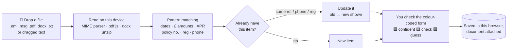

# Personal Admin Assistant

One place for every insurance policy, contract and regular payment: mobile phones, TV
licence, council tax, cars, credit cards and the rest. It reminds you before anything renews,
and you can drop in emails and documents to have the details read automatically.

**It's local-only.** It's a single HTML file that runs in your browser. Your data is stored in
that browser on your device, and the page's security policy stops it making *any* network
connection.

## Using it

1. Download **[`PersonalAdmin.html`](PersonalAdmin.html)** and save it somewhere permanent
   (e.g. `Documents/PersonalAdmin.html`).
2. Double-click it to open it in **Chrome, Edge or Firefox**. Bookmark it or pin the tab.
3. Add the people in your household (**People**), then drag in renewal emails, PDFs and contracts.

> Always open the same file in the same browser. The data belongs to that browser profile, so
> use **Settings → Download backup** now and then (the dashboard nudges you every 30 days).

## How the "drop a document" flow works



It's like a good PA opening your post: it reads the letter, highlights the important bits,
fills in the card, and hands it to you to check before filing it.

### Getting emails in

| Mail app | How |
|---|---|
| Gmail (web) | Open email → ⋮ → **Download message** (.eml) → drop it in |
| Outlook (desktop) | Drag the email to your desktop (.msg) → drop it in |
| Outlook.com / Apple Mail | Save / download as .eml (Apple Mail: drag to Finder) |
| Anything | Select the text and drag it onto the page, or paste it in **Add from file** |

PDFs attached to a `.eml` are read automatically. Images are attached, but they aren't read
(there's no OCR).

## Features

- **Categories** for insurance (car, home, pet, travel, life, breakdown), mobile, broadband, TV,
  TV licence, council tax, energy, water, credit cards, loans, mortgages, savings, MOT/tax,
  subscriptions, memberships and warranties, each with its own fields (vehicle reg, phone
  number, handset, APR, promo end date, credit limit, band…).
- **Belongs to.** Tag each item to a person. Phone bills are matched to a person by mobile number.
- **Reminders.** By default you get reminders 30, 7 and 1 days before each renewal/end date, plus
  "last day to give notice" and "promo rate ends" reminders, and custom reminders with snooze.
  Ticking one off only clears it for that year.
- **Mark as renewed.** Moves the dates on, keeps last year's price and shows the % change.
- **Dashboard.** Needs-attention list, a 12-month renewal timeline, spending by type and by person.
- **Calendar.** A month view, plus a **.ics export** so reminders show up in Google/Apple/Outlook
  calendar on your phone.
- Desktop notifications while the tab is open, CSV export, JSON backup/restore, and dark mode.

## Development

```bash
npm test        # extraction + reminder unit tests (Node's built-in runner, no installs)
npm run build   # bundles src/ + vendor/ into PersonalAdmin.html
```

`src/` holds the source (`core.js` data model, `extract.js` text→fields, `parsers.js`
file→text, `db.js` IndexedDB, `app.js` UI). `vendor/` is pdf.js 3.11 (Apache-2.0). Rebuild
and commit `PersonalAdmin.html` after changing anything in `src/`.
